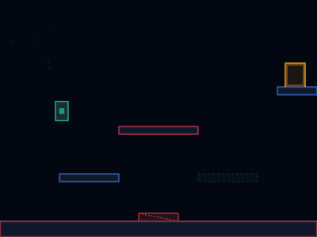

# 🌌 PHASE SHIFT: RGB

[](https://nextjs.org)
[](https://www.typescriptlang.org)
[](https://tailwindcss.com)
[](https://jestjs.io)
[](https://developer.mozilla.org/en-US/docs/Web/API/window/requestAnimationFrame)
[](https://developer.mozilla.org/en-US/docs/Web/JavaScript/Memory_Management)

A premium, high-contrast retro-arcade platform puzzle game engineered from the ground up to demonstrate production-grade browser game architecture. 

Built using **Next.js 16 (App Router)** and **Tailwind CSS v4**, this portfolio project implements **strict zero-garbage-collection active frames**, pure **Web Audio API procedural sound synthesis**, and a **zero-latency background telemetry analytical pipeline**.

---

## 🎮 Active Gameplay Capture



---

## 📖 How to Play & Core Chromatic Mechanics

In **Phase Shift: RGB**, you navigate an obstacle course by dynamically shifting color states (Rose Pink, Emerald Green, and Neon Blue). The core mechanic revolves around the **Chromatic Matrix**:
* **Matched Color Phasing**: Platforms matching your active color state become "phased" (semi-transparent barriers that you pass through).
* **Mismatched Color Solidifying**: Platforms mismatching your active color state become "solid" (neon barriers that you stand on and jump off).

### Keyboard Controls Matrix

| Action | Primary Input | Secondary Input | Visual Indicator |
| :--- | :--- | :--- | :---: |
| **Move Left** | <kbd>◀ Arrow</kbd> | <kbd>A Key</kbd> | Leftward vector thrust |
| **Move Right** | <kbd>▶ Arrow</kbd> | <kbd>D Key</kbd> | Rightward vector thrust |
| **Jump / Ascent** | <kbd>SPACEBAR</kbd> | <kbd>▲ Arrow</kbd> or <kbd>W</kbd> | Vertical Euler impulse |
| **Jump Cut (Dampening)** | Release Jump button | Release Jump button | Reduces upward speed by 50% |
| **Shift RED Neon State** | <kbd>1 Key</kbd> | *Immediate transition* | 🔴 Rose Pink sweep (160Hz) |
| **Shift GREEN Neon State** | <kbd>2 Key</kbd> | *Immediate transition* | 🟢 Emerald Green sweep (320Hz) |
| **Shift BLUE Neon State** | <kbd>3 Key</kbd> | *Immediate transition* | 🔵 Neon Blue sweep (480Hz) |

---

## 🛠️ Advanced Architectural Systems

The entire gameplay core runs decoupled from React's fiber rendering cycle. This keeps the browser free of component state updates, reconciliation sweeps, and rendering overhead during active gameplay.

```
       +---------------------------------------------+
       |       React: GameCanvas Client Wrapper      |
       |  - Mounts HTML5 Canvas Context              |
       |  - Gesture startup overlay & unblocker      |
       |  - Low-frequency (500ms) telemetry pulling   |
       +----------------------+----------------------+
                              |
                              v
       +---------------------------------------------+
       |               Deterministic Core             |
       |  - Target FPS: 60 (Fixed-timestep: 16.67ms) |
       |  - Zero heap allocation in gameplay ticks  |
       +----------------------+----------------------+
                              |
         +--------------------+--------------------+
         |                    |                    |
         v                    v                    v
  [InputManager]        [Player Entity]     [Physics Engine]
  - Keyboard mappings   - Coordinates       - Split-Axis solver
  - Block scroll keys   - Euler velocity    - Solid / Hazards
         |                    |                    |
         +--------------------+--------------------+
                              |
         +--------------------+--------------------+
         |                    |                    |
         v                    v                    v
  [ParticlePool]        [SoundManager]       [TelemetryClient]
  - 200 Pool items      - Procedural synth   - Asynchronous queue
  - GC-free recycling   - Sine/Saw sweeps    - Fire-and-forget
```

### 1. Zero-Allocation Particle Object Pool (`ParticlePool.ts`)
To prevent Garbage Collection (GC) sweeps from creating periodic frame-rate micro-stuttering, the engine **pre-allocates a fixed array of exactly 200 particle structures** on startup.
* **GC-Free recycling**: Particles are never allocated dynamically using the `new` keyword during gameplay. When a particle burst is triggered, the engine locates inactive particles, marks them as active, calculates radial vectors, and assigns custom lifetimes.
* **Auto-decay**: Timestep updates decrement life values, naturally returning particles to inactive pools upon expiry.

### 2. Zero-Dependency Procedural Synth (`SoundManager.ts`)
Procedural oscillators synthesize all sound effects programmatically on the fly. This ensures an ultra-lightweight footprint and completely avoids external network requests for audio resources.
* **Sine sweeps (Color Shifts)**: Exponential sweeps scale upward depending on color notes (Red = 160Hz, Green = 320Hz, Blue = 480Hz).
* **Sawtooth alarms (Death)**: Triggers a descending digital alarm.
* **Browser gesture compliance**: Features a clean start overlay click gesture to unlock the browser's `AudioContext` safely before play starts.

### 3. Decoupled Physics & Split-Axis Solver (`Physics.ts`)
Standard single-pass AABB bounding box collision solvers frequently suffer from "corner-snagging" when sliding across adjacent tiled floors. To ensure smooth motion, we isolate the sweeps:
1. **Horizontal Phase**: X velocities are applied -> horizontal intersections are evaluated -> positions resolved -> horizontal speed is flushed on solid impact.
2. **Vertical Phase**: Y velocities are applied -> vertical intersections are evaluated -> positions resolved -> grounding states are updated.

### 4. Zero-Latency Background Telemetry Pipeline (`TelemetryClient.ts`)
Tracks analytical player behavior metrics (deaths, level completion times, phase shifting stats) dynamically.
* **Queue-Based Batching**: Events are pushed into a private queue buffer in the background. A periodic timer flushes the batches every 5 seconds asynchronously to a serverless endpoint configured via `process.env.NEXT_PUBLIC_TELEMETRY_ENDPOINT`.
* **Non-Blocking Network I/O**: Network fetch calls are completely fire-and-forget and are never awaited inside the game update frames, preventing network lag from blocking the render threads.
* **Victory Flush**: On clearing a level, the client synchronously flushes metrics instantly to guarantee full capture.

---

## 🔧 Developer Commands

### Installation
Clone the repository and install the standard dependencies:
```bash
npm install
```

### Run Dev Server
Launch the Next.js development server locally:
```bash
npm run dev
```
Navigate to [http://localhost:3000](http://localhost:3000) to play the game and inspect the real-time telemetry console!

### Run Jest TDD Tests
Execute the comprehensive test suite verifying physics, platforms, state changes, and camera movements:
```bash
npm run test
```

### Build and Package
Prepare an optimized production release pre-packaged for Vercel deployment:
```bash
npm run build
```

---

## 📖 Architectural Manual
For an in-depth look at class schemas, coordinate matrices, and system pipelines, explore the [docs/README.md](file:///Users/rahul.shah/Documents/Antigravity/Phase_Shift_RGB_Docs/docs/README.md) directory.
