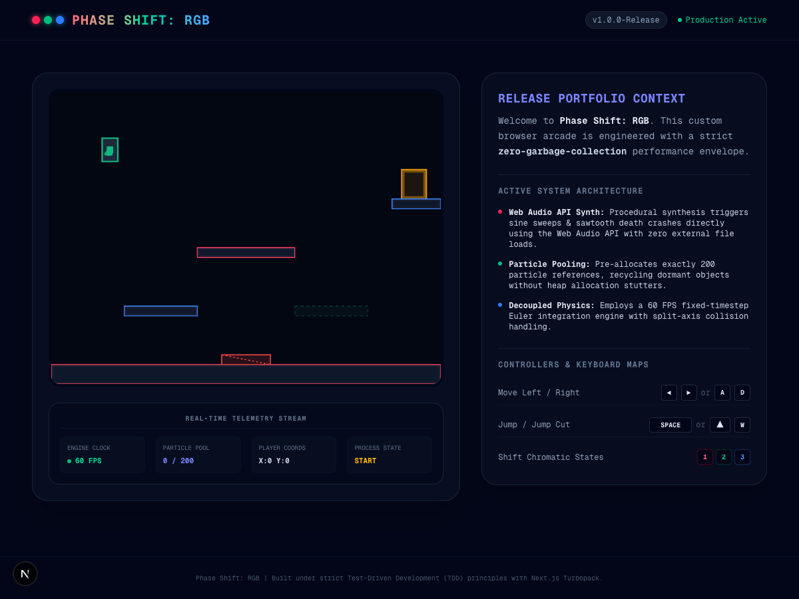
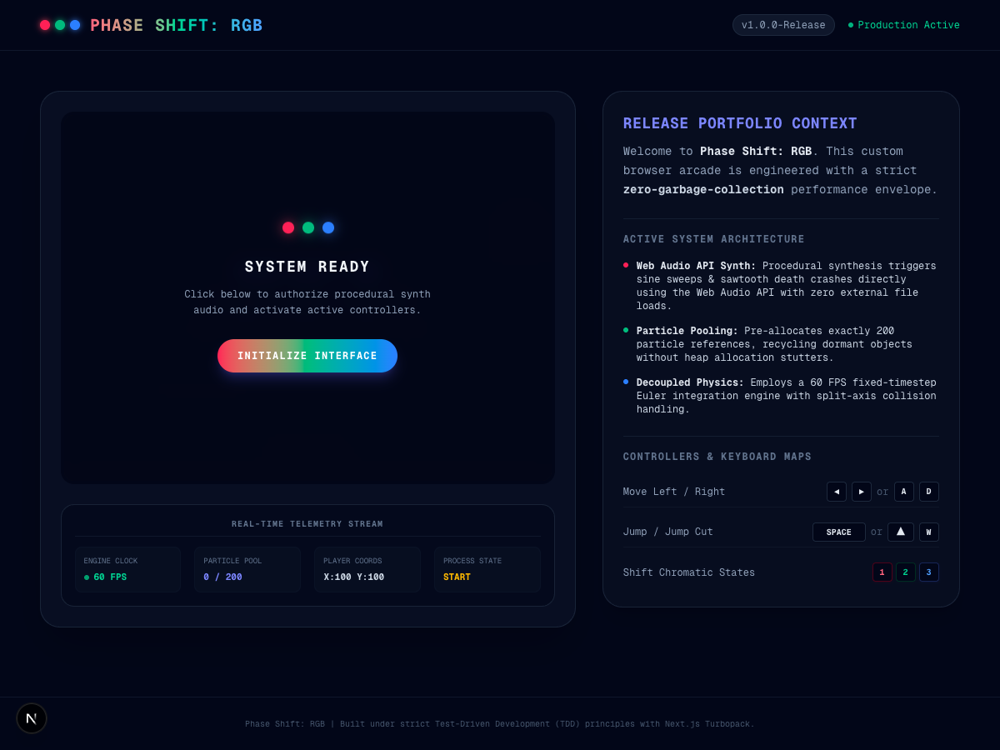

# 🌌 PHASE SHIFT: RGB

[](https://nextjs.org)
[](https://www.typescriptlang.org)
[](https://tailwindcss.com)
[](https://jestjs.io)
[](https://developer.mozilla.org/en-US/docs/Web/API/window/requestAnimationFrame)
[](https://developer.mozilla.org/en-US/docs/Web/JavaScript/Memory_Management)

A premium, high-contrast retro-arcade platform puzzle game engineered from the ground up to demonstrate production-grade browser game architecture. 

Built using **Next.js 16 (App Router)** and **Tailwind CSS v4**, this portfolio project implements **strict zero-garbage-collection active frames** and pure **Web Audio API procedural sound synthesis** without external asset dependencies.

---

## 🎮 The Gameplay Experience

In **Phase Shift: RGB**, you navigate an obstacle course by dynamically shifting color states (Rose Pink, Emerald Green, and Neon Blue). Platforms matching your active color state become "phased" (semi-transparent barriers you pass through), while mismatched platforms act as solid barriers you jump on to progress.

| Active Retro Gameplay Platform | Real-time Analytics Dashboard |
| :---: | :---: |
|  |  |

---

## 🛠️ Advanced Architectural Systems

The entire gameplay core runs decoupled from React's fiber rendering cycle. This keeps the browser free of component state updates, reconciliation sweeps, and rendering overhead during active gameplay.

```
       +---------------------------------------------+
       |       React: GameCanvas Client Wrapper      |
       |  - Mounts HTML5 Canvas Context              |
       |  - Gesture startup overlay & unblocker      |
       |  - Low-frequency (500ms) telemetry pulling   |
       +----------------------+----------------------+
                              |
                              v
       +---------------------------------------------+
       |               Deterministic Core             |
       |  - Target FPS: 60 (Fixed-timestep: 16.67ms) |
       |  - Zero heap allocation in gameplay ticks  |
       +----------------------+----------------------+
                              |
         +--------------------+--------------------+
         |                    |                    |
         v                    v                    v
  [InputManager]        [Player Entity]     [Physics Engine]
  - Keyboard mappings   - Coordinates       - Split-Axis solver
  - Block scroll keys   - Euler velocity    - Solid / Hazards
         |                    |                    |
         +--------------------+--------------------+
                              |
         +--------------------+--------------------+
         |                                         |
         v                                         v
  [ParticlePool]                            [SoundManager]
  - 200 Pre-allocated particles             - Procedural synth
  - GC-free recycling emit                  - Sine/Saw sweeps
```

### 1. Zero-Allocation Particle Object Pool (`ParticlePool.ts`)
To prevent Garbage Collection (GC) sweeps from creating periodic frame-rate micro-stuttering, the engine **pre-allocates a fixed array of exactly 200 particle structures** on startup.
* **GC-Free recycling**: Particles are never allocated dynamically using the `new` keyword during gameplay. When a particle burst is triggered, the engine locates inactive particles, marks them as active, calculates radial vectors, and assigns custom lifetimes.
* **Auto-decay decay**: Timestep updates decrement life values, naturally returning particles to inactive pools upon expiry.

### 2. Zero-Dependency Procedural Synth (`SoundManager.ts`)
Procedural oscillators synthesize all sound effects programmatically on the fly. This ensures an ultra-lightweight footprint and completely avoids external network requests for audio resources.
* **Sine sweeps (Color Shifts)**: Exponential sweeps scale upward depending on color notes (Red = 160Hz, Green = 320Hz, Blue = 480Hz).
* **Sawtooth alarms (Death)**: Triggers a descending digital alarm.
* **Browser gesture compliance**: Features a clean start overlay click gesture to unlock the browser's `AudioContext` safely before play starts.

### 3. Decoupled Physics & Split-Axis Solver (`Physics.ts`)
Standard single-pass AABB bounding box collision solvers frequently suffer from "corner-snagging" when sliding across adjacent tiled floors. To ensure smooth motion, we isolate the sweeps:
1. **Horizontal Phase**: X velocities are applied -> horizontal intersections are evaluated -> positions resolved -> horizontal speed is flushed on solid impact.
2. **Vertical Phase**: Y velocities are applied -> vertical intersections are evaluated -> positions resolved -> grounding states are updated.

### 4. Low-Frequency Telemetry Dashboard Panel (`GameCanvas.tsx`)
A telemetry stream widget displays real-time Engine Clock (FPS), active particle count, player coordinate vectors, and game state. Telemetry metrics are pulled at a low-frequency **500ms interval** to completely bypass React state reconciliation costs during gameplay.

---

## 🔧 Developer Commands

### Installation
Clone the repository and install the standard dependencies:
```bash
npm install
```

### Run Dev Server
Launch the Next.js development server locally:
```bash
npm run dev
```
Navigate to [http://localhost:3000](http://localhost:3000) to play the game and inspect the real-time telemetry console!

### Run Jest TDD Tests
Execute the comprehensive test suite verifying physics, platforms, state changes, and camera movements:
```bash
npm run test
```

### Build and Package
Prepare an optimized production release pre-packaged for Vercel deployment:
```bash
npm run build
```

---

## 📁 Technical Code Structure

```
Phase_Shift_RGB/
├── docs/
│   ├── README.md                    # Core architecture design manual
│   └── 01_PRD.md                    # Initial product requirements document
├── public/
│   └── assets/
│       ├── gameplay_screenshot.png   # High-fidelity gameplay mockup
│       └── dashboard_screenshot.png  # Telemetry dashboard mockup
├── src/
│   ├── app/
│   │   ├── globals.css              # Custom Tailwind CSS v4 styling rules
│   │   └── page.tsx                 # Sleek dark portfolio UI layout
│   ├── components/
│   │   ├── GameCanvas.tsx           # React client wrapper & stats dashboard
│   │   └── __tests__/               # Canvas lifecycle mounting tests
│   └── core/
│       ├── GameEngine.ts            # Central game clock (fixed 60 FPS)
│       ├── audio/
│       │   └── SoundManager.ts      # Programmatic procedural audio synth
│       ├── entities/
│       │   └── Player.ts            # Player velocity & Euler math updates
│       ├── input/
│       │   └── InputManager.ts      # Anti-scroll native keyboard controls
│       ├── level/
│       │   ├── LevelManager.ts      # Stage progression & level indexing
│       │   └── LevelParser.ts       # Secure platform parsing validations
│       ├── logic/
│       │   ├── CollisionMatrix.ts   # Phase matrix filters (colorState matches)
│       │   └── GameState.ts         # Central finite state machine enums
│       ├── math/
│       │   ├── AABB.ts              # Bounding boxes intersection logic
│       │   └── Physics.ts           # Euler integration split-axis solver
│       └── render/
│           ├── Camera.ts            # Smooth Lerp follow scroll bounds
│           ├── ParticlePool.ts      # GC-free visual feedback object pool
│           └── Renderer.ts          # canvas context translating roundings
└── tsconfig.json                    # Strict type-checking controls
```

---

## 📜 Portability & Licensing
This project is open-source and available under the **MIT License**. Created under strict Test-Driven Development principles to showcase premium browser game mechanics.
