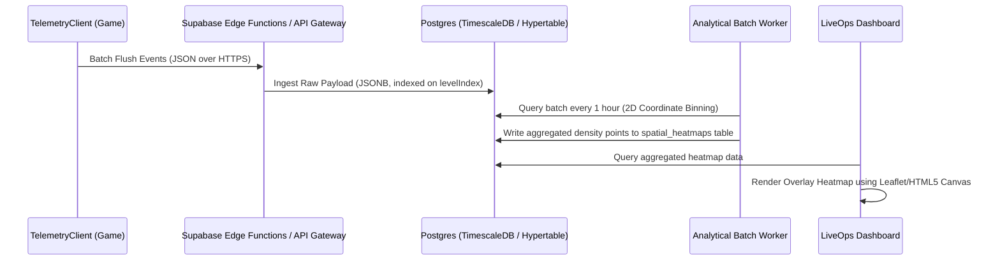
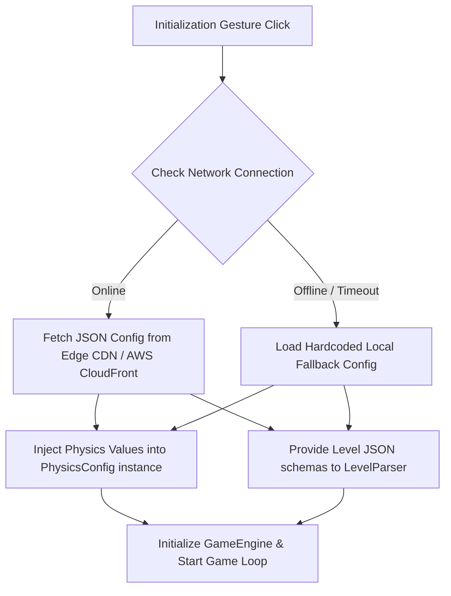

# Product Requirements Document (PRD): Future Scaling & LiveOps Architecture

## 1. Executive Summary & Objective

**Phase Shift: RGB** currently operates as a high-performance, zero-latency, client-side browser platformer with localized assets. As the game transitions into a scalable portfolio showcase and a live-service product, we require the ability to empirically balance difficulty curves, ingest player behavioral data, and modify game physics or layouts dynamically without shipping code updates.

This document details the architecture for **Telemetry Ingestion**, **Remote Physics/Level Tuning**, **Dynamic A/B Testing**, and a unified **Content Level Pipeline** to transform the game into an agile, data-driven experience.

---

## 2. Telemetry Ingestion & Spatial Analytics

To identify "choke points" where players fail or find sections overly frustrating, we will process real-time telemetry events emitted by the client's `TelemetryClient` into spatial heatmaps.

### 2.1 Event Schemas

The client currently emits structured events during gameplay. The backend ingestion layer (Supabase / Firebase Functions) will capture and timestamp these events:

| Event Type | Payload Fields | Purpose |
| :--- | :--- | :--- |
| **`DeathEvent`** | `{ x: number, y: number, levelIndex: number, activeColor: ColorState, timeAlive: number }` | Maps exact coordinates and player colors during a failure event. |
| **`LevelCompleteEvent`** | `{ levelIndex: number, totalTime: number, phaseShiftCount: number }` | Measures overall level duration and complexity metric (color swaps). |

### 2.2 Heatmap Ingestion Architecture



### 2.3 Spatial Coordinate Binning Algorithm

To convert millions of coordinate points into a lightweight heatmap, the analytical pipeline uses a 2D grid coordinate binning algorithm:

1. **Resolution Scale**: Group level coordinate grids into $32 \times 32$ pixel bins (matching the game's tile unit size).
2. **Formula**:
   $$\text{Bin}_x = \lfloor \frac{x}{32} \rfloor, \quad \text{Bin}_y = \lfloor \frac{y}{32} \rfloor$$
3. **Clustering**: Apply Density-Based Spatial Clustering (DBSCAN) to identify high-density coordinate clusters where player deaths exceed a determined threshold (e.g., $>15\%$ of total level attempts).
4. **Actionable Alerting**: If a cluster is flagged, trigger LiveOps alerts detailing the coordinate, the active color state at death, and average time elapsed, indicating a potential "snag point" or collision bug.

---

## 3. Remote Configuration & LiveOps Tuning

To balance physics variables and update level structures dynamically, we will transition the hardcoded parameters from `PhysicsConfig.ts` and the static definitions in `LevelManager.ts` to a secure CDN-backed JSON configuration API.

### 3.1 Architecture Overview



### 3.2 Physics Parameter Schema

Instead of hardcoded constants, `PhysicsConfig` will be initialized using a typed JSON structure:

```json
{
  "version": "1.0.4",
  "physics": {
    "MOVE_ACCELERATION": 0.0015,
    "GROUND_FRICTION": 0.85,
    "AIR_DRAG": 0.98,
    "GRAVITY": 0.0012,
    "JUMP_IMPULSE": -0.42,
    "TERMINAL_VELOCITY_X": 0.35,
    "TERMINAL_VELOCITY_Y": 0.85
  }
}
```

> [!TIP]
> **Zero-Deployment Tuning**
> By altering `JUMP_IMPULSE` or `GRAVITY` in the CDN configuration file, LiveOps developers can adjust jump trajectories in real time to compensate for player lag or to increase accessibility on mobile touch-interfaces.

---

## 4. Dynamic A/B Testing Framework

To scientifically validate balancing decisions (e.g., "Does a 5% reduction in gravity improve Level 2 completion rates without reducing player engagement?"), we will introduce an inline, zero-latency A/B testing router.

### 4.1 Bucket Allocation System

Upon initialization, the client generates or retrieves a unique persistent client UUID. The player is hashed into a test bucket synchronously:

```typescript
import { PhysicsConfig } from './config/PhysicsConfig';

export function routeA/BTest(playerUuid: string, remoteConfigPayload: any) {
  // Simple deterministic hash matching a bucket [0, 99]
  let hash = 0;
  for (let i = 0; i < playerUuid.length; i++) {
    hash = (hash << 5) - hash + playerUuid.charCodeAt(i);
    hash |= 0; // Convert to 32bit integer
  }
  const bucket = Math.abs(hash) % 100;

  if (bucket < 50) {
    // Group A (Control - Baseline Physics)
    applyPhysicsConfig(remoteConfigPayload.control);
    trackExperimentAssignment("Experiment_Gravity_V1", "Control");
  } else {
    // Group B (Treatment - 5% Lighter Gravity)
    applyPhysicsConfig(remoteConfigPayload.treatment_light_gravity);
    trackExperimentAssignment("Experiment_Gravity_V1", "Treatment_Light");
  }
}
```

### 4.2 Key Performance Indicators (KPIs) to Track

To evaluate experiment success, the batch analytical engine will correlate assignment buckets with events to calculate the following metrics:

1. **Completion Rate ($CR_L$)**:
   $$CR_L = \frac{\sum \text{LevelCompleteEvents}_L}{\sum \text{LevelCompleteEvents}_L + \sum \text{DeathEvents}_L}$$
2. **Phase-Shift Friction Index ($PSFI$)**:
   $$\text{Average Color Shifts per Complete Level}$$
3. **Frustration Coefficient ($FC$)**:
   $$\text{Average Deaths per Completed User}$$

An experiment will be promoted to the default production profile if Group B shows a statistically significant increase in $CR_L$ ($p < 0.05$) without a corresponding reduction in playtime or phase-shift interactions.

---

## 5. Content Pipeline & Visual Level Editor Schema

To empower game designers to build complex stages without editing source files, we will create a web-based, drag-and-drop Visual Level Editor. The editor will parse and serialize maps matching the `LevelParser.ts` interface.

### 5.1 Serializable JSON Schema (`LevelSchema.json`)

The Visual Level Editor will compile and validate layouts against the following standardized JSON Schema:

```json
{
  "$schema": "http://json-schema.org/draft-07/schema#",
  "title": "PhaseShiftLevel",
  "type": "object",
  "properties": {
    "levelIndex": {
      "type": "integer",
      "minimum": 0
    },
    "levelName": {
      "type": "string"
    },
    "spawnX": {
      "type": "number"
    },
    "spawnY": {
      "type": "number"
    },
    "bounds": {
      "type": "object",
      "properties": {
        "width": { "type": "number" },
        "height": { "type": "number" }
      },
      "required": ["width", "height"]
    },
    "platforms": {
      "type": "array",
      "items": {
        "$ref": "#/definitions/Platform"
      }
    }
  },
  "required": ["levelIndex", "levelName", "spawnX", "spawnY", "bounds", "platforms"],
  "definitions": {
    "Platform": {
      "type": "object",
      "properties": {
        "x": { "type": "number" },
        "y": { "type": "number" },
        "width": { "type": "number" },
        "height": { "type": "number" },
        "type": {
          "type": "string",
          "enum": ["SOLID", "HAZARD", "GOAL"]
        },
        "colorState": {
          "type": "string",
          "enum": ["RED", "GREEN", "BLUE", "NEUTRAL"]
        }
      },
      "required": ["x", "y", "width", "height", "type", "colorState"]
    }
  }
}
```

### 5.2 Dynamic Grid Alignment

The visual editor will enforce a strict grid placement system:
- **Default Grid Cell Size**: $32 \times 32$ pixels.
- **Snapping Algorithm**: Platform coordinates and sizes are snapped on drag-release:
  $$x_{\text{snapped}} = \text{round}(x / 32) \times 32$$
  $$y_{\text{snapped}} = \text{round}(y / 32) \times 32$$
- **Color Overlay View**: Designers can toggle visual overlays (Red, Green, Blue matching the RGB spectrum) to preview platform collidability from the player's perspective, ensuring levels are mathematically beatable before serialization.

---

> [!WARNING]
> **Level Size Rendering Limits**
> To maintain high rendering speeds and a locked 60 FPS profile on lower-spec mobile units, visual stages should be limited to a maximum of **150 platform coordinates** per viewport camera segment, ensuring standard browser canvas operations are completely bottleneck-free.
