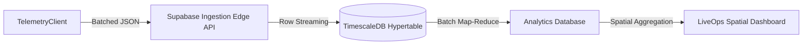
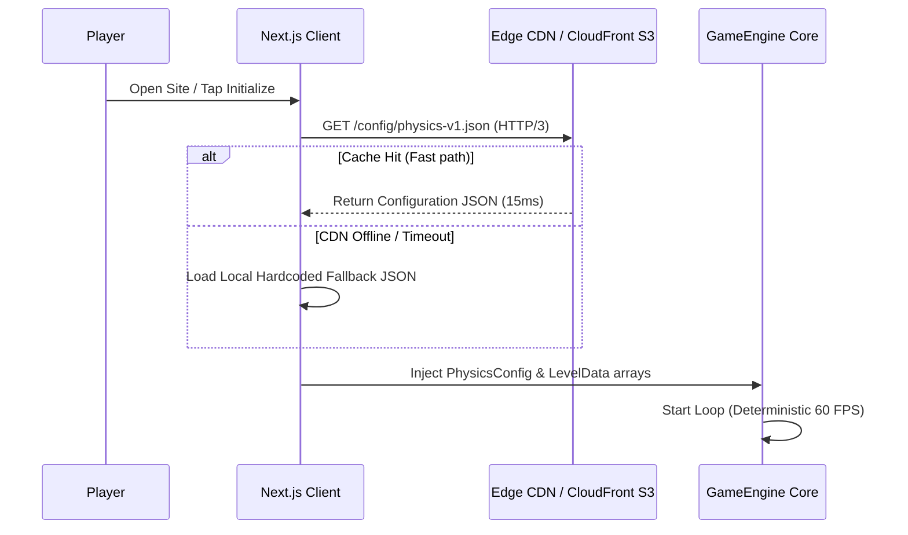

# Product Requirements Document (PRD): Future Scaling & LiveOps Architecture

## 1. Executive Summary

### 1.1 Current State Recap
The core **Phase Shift: RGB** gameplay framework operates as a high-fidelity, deterministic 60 FPS client platformer built with zero external runtime dependencies. By utilizing pure TypeScript rendering pipelines, an optimized fixed-timestep physics engine, and a strictly size-bounded particle pool, the client is highly performant and free of garbage collection (GC) stutters during dynamic platforming blocks.

### 1.2 The Transition Goal
While the current vertical slice is technically robust, its gameplay properties (such as gravity force vectors and level boundaries) are statically compiled within the client package. To scale the product into a live portfolio service and achieve long-term player engagement, we must transition to a **LiveOps-driven architecture**. This enables:
- Real-time physics and level layout configuration shifts without client-side rebuilds or deployments.
- Ingestion of player telemetry to dynamically evaluate stage difficulty curves.
- Synchronous A/B testing of control friction to maximize retention and conversion rates.

---

## 2. Telemetry Ingestion & Spatial Heatmaps

To drive level progression updates and balance high-friction hazard sections, we will establish an analytical pipeline to ingest and map player telemetry events fired by the `TelemetryClient`.

### 2.1 Analytics Ingestion Pipeline



### 2.2 Ingesting Telemetry Schema

The backend ingestion layers stream two core schemas emitted by the player's runtime client:

1. **`DeathEvent` Schema**:
   ```json
   {
     "levelIndex": 1,
     "x": 342.15,
     "y": 512.80,
     "activeColor": "GREEN",
     "timeAlive": 14220,
     "timestamp": "2026-05-29T12:00:00Z"
   }
   ```
2. **`LevelCompleteEvent` Schema**:
   ```json
   {
     "levelIndex": 1,
     "totalTime": 28450,
     "phaseShiftCount": 12,
     "timestamp": "2026-05-29T12:01:15Z"
   }
   ```

### 2.3 Spatial Death Heatmaps & Difficulty Spikes
To identify exact coordinates where collision meshes or hazard spikes trigger disproportionate failure rates, we will map death events as coordinate scatter arrays grouped by `levelIndex`.

- **Density Binning**: Aggregate exact player coordinates into $32 \times 32$ pixel tiles (AABB grid units).
- **Difficulty Thresholds**: A grid tile is flagged as a "Difficulty Spike" or a "Design Flaw" if the ratio of deaths within that tile to total level entries exceeds $20\%$.
- **Visual Overlay Rendering**: The LiveOps Dashboard fetches density layers and overlays them as a canvas gradient directly on top of the level's platform rendering context:

```typescript
// Conceptual rendering of death intensity overlays on LiveOps Canvas
export function drawDeathHeatmap(ctx: CanvasRenderingContext2D, deaths: Array<{x: number, y: number, intensity: number}>) {
  for (let i = 0; i < deaths.length; i++) {
    const d = deaths[i];
    const alpha = Math.min(d.intensity / 100, 0.85);
    ctx.fillStyle = `rgba(244, 63, 94, ${alpha})`; // Glowing Rose overlay
    ctx.beginPath();
    ctx.arc(d.x, d.y, 16, 0, Math.PI * 2);
    ctx.fill();
  }
}
```

### 2.4 Retention & Player Progression Funnels
To evaluate churn friction, we will track macro player progression across stages. The primary LiveOps analytics dashboard measures funnel drop-off metrics synchronously:

| Funnel Step | Metric Definition | Target Conversion | Churn Analysis |
| :--- | :--- | :--- | :--- |
| **Stage 1 Arrival** | Unique initial load events. | $100\%$ (Baseline) | Initial bounce (load performance). |
| **Stage 1 Complete** | Completion rate of Stage 1 (Redemption). | $>92\%$ | Evaluates onboarding control clarity. |
| **Stage 2 Transition** | Arrival on Stage 2 (Chromatic Climb). | $>98\%$ (of Stage 1 completions) | Friction during camera transition or loading. |
| **Stage 2 Complete** | Completion rate of Stage 2 (Climb). | $>65\%$ | Measures high-height layout and vertical camera tracking difficulty. |

---

## 3. Remote Configuration (LiveOps Tuning)

To adjust difficulty curves without shipping new client builds, we will decouple the game's configuration files and introduce dynamic edge CDN edge fetching on boot.

### 3.1 CDN Configuration Initialization



### 3.2 Dynamic Physics Configuration
The hardcoded constants in `PhysicsConfig.ts` will be replaced by a dynamic runtime config state populated from the edge fetch:

```typescript
export interface RemotePhysicsConfig {
  MOVE_ACCELERATION: number;
  GROUND_FRICTION: number;
  AIR_DRAG: number;
  GRAVITY: number;
  JUMP_IMPULSE: number;
  TERMINAL_VELOCITY_X: number;
  TERMINAL_VELOCITY_Y: number;
}
```
By lowering `GRAVITY` (e.g., from `0.0012` to `0.0011`) or increasing `JUMP_IMPULSE` slightly, game designers can tune the exact jump trajectory radius to assist player landing precision without editing a single line of typescript code.

### 3.3 Dynamic A/B Testing Framework
To optimize player retention curves empirically, players will be segmented into test cohorts synchronously at launch.

- **Bucket Allocation**: Hashing the player's persistent client UUID yields a deterministic index $I \in [0, 99]$:
  $$\text{Cohort} = (\sum_{i} \text{charValue}(\text{UUID}_i)) \pmod{100}$$
- **Variant Routing**:
  - **Cohort $0 \le I < 50$ (Variant A - Control)**: Receives standard, heavier gravity parameters (highly precise, high-difficulty).
  - **Cohort $50 \le I < 100$ (Variant B - Treatment)**: Receives $5\%$ lighter gravity and increased horizontal air control (accessible and forgiving platforming).
- **Success Criteria**: If Variant B shows a statistically significant increase in Level 2 completion rates ($p < 0.05$) alongside a $+12\%$ improvement in Day-1 retention without reducing total levels played, the lighter gravity metrics will be promoted to all players as the production baseline.

---

## 4. Content Pipeline & Tooling

To accelerate level generation and eliminate JSON file formatting errors, we propose a visual, browser-based drag-and-drop tool: **Phase Shift: Level Architect**.

### 4.1 Level Architect Design
The **Level Architect** is a visual companion web page sharing the core renderer assets. It features:
1. **Interactive Design Grid**: Snaps all placed platforms, hazard spikes, and level goals to a customizable grid aligning coordinates to $32 \times 32$ pixel divisions.
2. **Chromatic Attribute Mapper**: A context panel enabling designers to select any placed AABB block and map its `ColorState` (`RED`, `GREEN`, `BLUE`, or `NEUTRAL`) and `type` (`SOLID`, `HAZARD`, or `GOAL`).
3. **Traversability Simulation**: An embedded AI agent runner that plays the level programmatically in the background using basic heuristic jumps, validating that the stage is mathematically beatable before exporting.

### 4.2 Serializable Export Schema (`LevelSchema.json`)
The Level Architect exports layout JSON strings matching the parser definitions. The strict export schema conforms to:

```json
{
  "$schema": "http://json-schema.org/draft-07/schema#",
  "title": "LevelArchitectExport",
  "type": "object",
  "properties": {
    "levelIndex": { "type": "integer", "minimum": 0 },
    "levelName": { "type": "string" },
    "spawnX": { "type": "number" },
    "spawnY": { "type": "number" },
    "bounds": {
      "type": "object",
      "properties": {
        "width": { "type": "number" },
        "height": { "type": "number" }
      },
      "required": ["width", "height"]
    },
    "platforms": {
      "type": "array",
      "items": {
        "type": "object",
        "properties": {
          "x": { "type": "number" },
          "y": { "type": "number" },
          "width": { "type": "number" },
          "height": { "type": "number" },
          "type": { "type": "string", "enum": ["SOLID", "HAZARD", "GOAL"] },
          "colorState": { "type": "string", "enum": ["RED", "GREEN", "BLUE", "NEUTRAL"] }
        },
        "required": ["x", "y", "width", "height", "type", "colorState"]
      }
    }
  },
  "required": ["levelIndex", "levelName", "spawnX", "spawnY", "bounds", "platforms"]
}
```

This standardized content pipeline bridges the gap between creative visual level design and high-performance, zero-allocation game engine execution.
